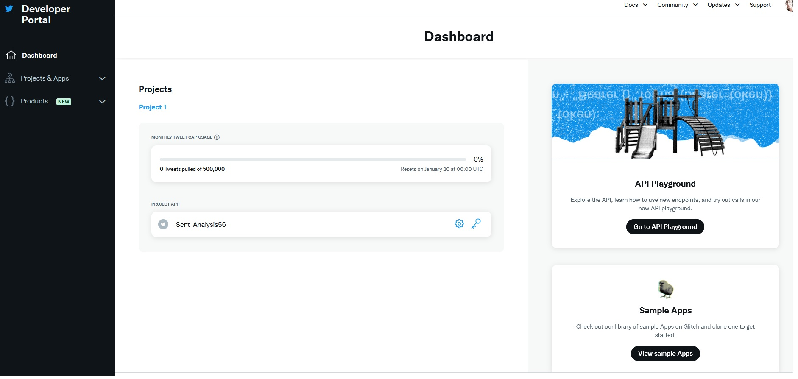
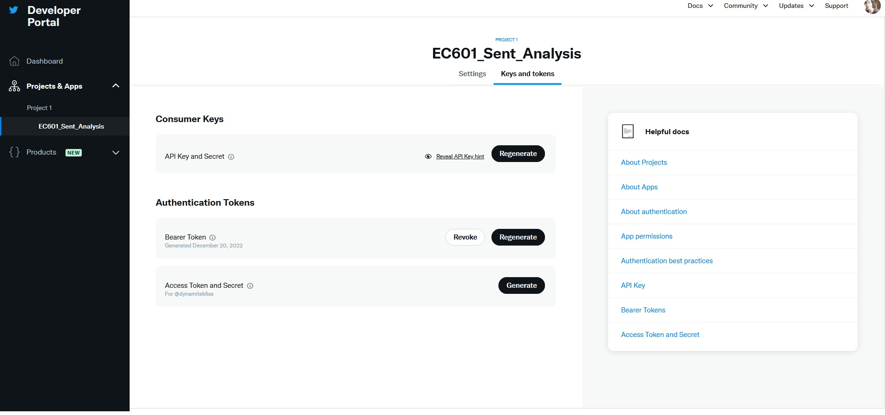

# EC601 - Product Design -- Project 2
### Taught by Prof. Osama Alshaykh at Boston University -- Fall 2022

This project explores the use of social media APIs to retrieve user content from web servers, and then analyzing the content to generate meaningful results for a given stakeholder. 

We start by defining the problem statement, then the user stories, then the Minimum Viable Product. We then classify the project into two parts: 1) API exploration & 2) MVP construction.

***Problem Statement:*** This is Elon Musk's PR company. Elon Musk wants to buy Twitter as a company for 44$ but his decision depends on how much twitter users like him. He has decieded that he will buy the company if more than 60% of the first 100,000 tweets that come up when twitter is searched "Elon Musk" are positive. For this, his public relations team needs to perform sentiment analysis on twitter tweets that have his name. 

***Minimum Viable Product*** : A program that takes input a string, performs search on that string, and performs sentiment analysis on the latest 100K tweets containing that string.

***User Stories***:

- As a user, I want to be able to search twitter for latest tweets for my given string.
- As a user, I want to be able to retrieve my required number of tweet from twitter.
- As a user, I want to decide if a tweet on twitter contains my client's name.
- As a user, I want to classify tweets as containing positive or negative sentiments for my client.

We decide to take the following approach in designing such application. We first explore the tools available to us. This includes exploring and testing multiple APIs which allow us to retrieve tweets from twitter, for example from a given string. We also will explore tools and APIs available to us that perform sentiment analysis on our given text. This is will be retreieved tweets in our case. Finally, we combine both components to make MVP.

## Phase 1a: API Exploration

### Tweepy

After reading the documentation, I found the follwoing information. 
To use the tweepy library to download tweets for a given search string, we need to have a Twitter developer account and obtain the necessary API keys and access tokens. Using pip, we also need to install the tweepy library using pip or any other method.

The images below show twitter developer account generation, and generation and retreival of keys required to use twitter API with tweepy. 

 

 

To search for tweets that were created within a specific time frame, similar to the other two programs, we can set up the necessary authentication and authorization to access the Twitter API and use the GET search/tweets endpoint to search for tweets that were created within a specific time frame. We need to specify the desired time frame using the since and until parameters in the endpoint.

Results: I was successfully able to searche for tweets that contain the specified words, hashtag, in specified time, if required, and print the text of each tweet to the console. We can modify variables to control the number of tweets that are downloaded, and you can also add additional code to process the tweets or save them to a file or database.

## Phase 1a: Sentiment Analysis using NLP

To perform sentiment analysis, we use Google NLP.
We set up a Google Cloud account and enable the Natural Language API by visiting the Google Cloud Console (https://console.cloud.google.com/). I then import the necessary modules and authenticate my API key. I perform the required enviroment variable adjustments and use my given program to test the API to see if it gives positive or negative result for a given text.

The sentiment score is a value between -1 and 1, with -1 indicating very negative sentiment and 1 indicating very positive sentiment. The magnitude is a value indicating the strength of the sentiment, with higher values indicating stronger sentiment.

## Phase 2: MVP Creation of a Social Media Analyzer

### Design Decisions

Design decisions in this application development include the following. We use python as the main development language since after API exploration we found out that python has the most APIs available for it. Integration and interfacing with Python langauge is the easiest and fastest as compared to other languages. These tools have already been written for Python. Another design decision that we are using is testing Google NLP package, for sentiment analysis. Though we could just download text and perform sentiment analysis on that, using Google's cloud has multiple benefits. One is that local NLP processing system, if sophisticated enough, would take processing power and time to perform. Given google cloud, we won't have to waste our storage and power on processing tweets. 

We modularize MVP Creation:

- Module 1: Set up tweet retrieval system using Tweepy 
- Module 2: Set up a cloud sentiment analysis system using Google NLP
- Module 3: Run tests using our required search text 
- Module 4: Collect results and present them to the client.

